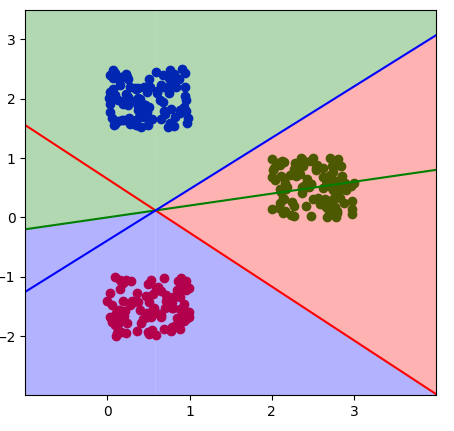
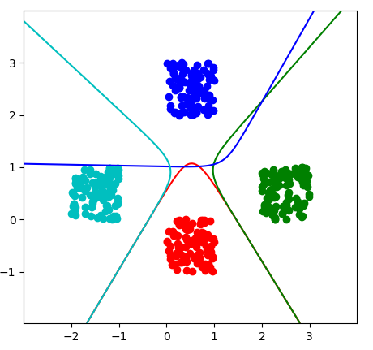

# Perception & Potential function
This is the repo for ***Pattern Recognition Course Task 2***, an implement of perception and potential
 function algorithms written in Python. All codes were tested in Ubuntu 18.04.  
 
   
  ## Preparation
 Installing dependency packages may change your packages' version, so it would be a good choice to create a virtual 
 environment.   
```
conda create -n PR_Task2 python=3.7
conda activate PR_Task2
pip install -r requirements.txt
```
## Running
Change to folder ```sources``` and command:   
```
python linear.py [<options>] 
``` 
or
```
python nonlinear.py [<options>] 
```
```[<options>]```can change the default args, including:  
+ cluster number
+ sample number per cluster
+ center points of clusters
## Contact
Horace.Kem, Soochow University   
E-mail:horacekem@163.com   
[GitHub](github.com/horacekem)